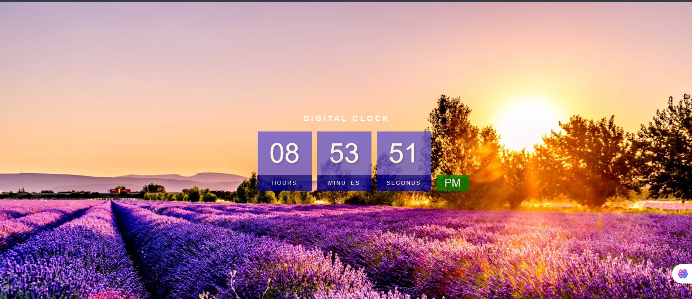

🕒 Digital Clock - Web Project
A responsive digital clock built using HTML, CSS, and JavaScript, featuring a real-time update of hours, minutes, seconds, and AM/PM. It also includes a custom background image and mobile responsiveness.

🔍 Features
⏱ Real-time digital clock (updates every second)

🌙 AM/PM indicator

🎨 Stylish layout with background image

📱 Mobile responsive design

🖌 Custom fonts and colors

project/
│
├── index.html       # Main HTML file
├── style.css        # Styling file
├── script.js        # JavaScript file for clock logic
└── img2.avif        # Background image
